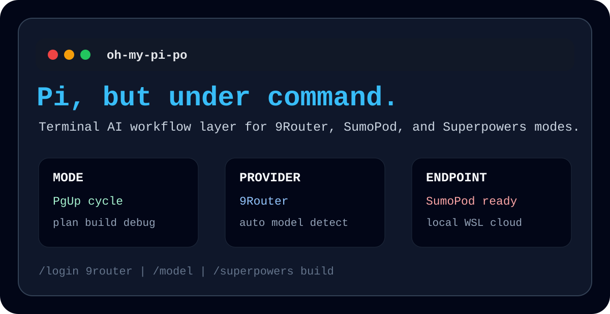
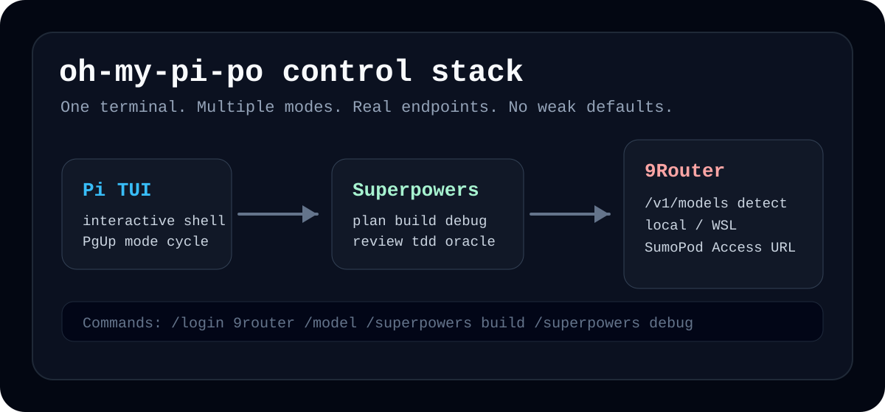

# oh-my-pi-po

<p align="center">
  
</p>

<p align="center">
  
  
  
  
</p>

**oh-my-pi-po** is a hardened Pi coding-agent setup for terminal-first AI work. It focuses on fast model switching, Superpowers workflows, 9Router access, SumoPod deployment support, and a cleaner interactive experience.

This repository is built for users who want a sharp local AI command center instead of a fragile chatbot wrapper.

## About

**oh-my-pi-po** is a terminal AI command center built on top of Pi. It turns Pi into a focused local workstation for coding agents, model routing, endpoint management, and mode-based workflows.

The goal is simple: keep the workflow fast, explicit, and under your control. Login to 9Router, detect models automatically, choose what you want to run, switch working modes with `PgUp`, and keep the terminal as the main control surface.

<p align="center">
  
</p>

## Core Features

- **Full Pi codebase**
  - This repository includes the Pi monorepo codebase, not only a README.
  - It is published as a standalone snapshot under `oh-my-pi-po`.

- **Superpowers modes**
  - Switch between specialized working modes such as planning, building, debugging, reviewing, and TDD.
  - `PgUp` cycles modes directly from the terminal editor.

- **9Router integration**
  - Connect Pi to a 9Router-compatible OpenAI endpoint.
  - Detect available models from `/v1/models`.
  - Show detected models immediately after login.

- **SumoPod support**
  - Use the SumoPod service Access URL directly.
  - Example:
    ```text
    https://9router-xxxx.cgk-max.sumopod.my.id
    ```
  - The setup normalizes it to:
    ```text
    https://9router-xxxx.cgk-max.sumopod.my.id/v1
    ```

- **Local and WSL support**
  - Default local endpoint:
    ```text
    http://127.0.0.1:20128/v1
    ```
  - WSL or Ubuntu endpoint can be configured through environment variables.

- **Cleaner interactive behavior**
  - Reduced noisy extension shortcut diagnostics.
  - Safer 9Router login flow with endpoint validation.
  - Better post-login model selection flow.

## What Was Built

This setup was built around a practical Pi workflow:

- **9Router provider**
  - Added support for connecting Pi to a 9Router-compatible endpoint.
  - Supports local, WSL, Ubuntu, and SumoPod deployments.
  - Uses OpenAI-compatible `/v1` API routing.

- **API key login**
  - `/login 9router` prompts for the API key.
  - Credentials are stored through Pi auth storage.
  - The provider validates the endpoint before letting the user proceed.

- **Model autodetection**
  - After login, Pi calls:
    ```text
    /v1/models
    ```
  - Returned models are converted into Pi model entries.
  - The model selector opens automatically after login.

- **SumoPod Access URL support**
  - The SumoPod dashboard URL is rejected.
  - The service Access URL is accepted and normalized.
  - Example:
    ```text
    https://9router-xxxx.cgk-max.sumopod.my.id
    ```

- **Superpowers mode switching**
  - `PgUp` cycles through modes without opening menus.
  - The shortcut remains configurable through `PI_SUPERPOWERS_CYCLE_SHORTCUT`.

- **Cleaner extension diagnostics**
  - `pageUp` no longer produces noisy selector-only shortcut conflict logs.

## Feature and Menu Reference

### Main Commands

| Command | Purpose |
|---------|---------|
| `/login 9router` | Connect Pi to a 9Router endpoint |
| `/logout 9router` | Remove stored 9Router credentials |
| `/model` | Open model selector |
| `/superpowers` | Open or configure Superpowers mode |
| `/superpowers plan` | Use planning mode |
| `/superpowers build` | Use implementation mode |
| `/superpowers debug` | Use debugging mode |
| `/superpowers review` | Use review mode |
| `/superpowers tdd` | Use test-driven development mode |

### Superpowers Modes

| Mode | Purpose |
|------|---------|
| `superpowers` | General enhanced workflow mode |
| `plan` | Break a task into a concrete implementation plan |
| `build` | Implement features and code changes |
| `debug` | Investigate failures and fix root causes |
| `review` | Inspect code quality and risk |
| `tdd` | Work through test-first changes |
| `sisyphus` | Push through repeated iteration |
| `prometheus` | Explore ideas and architecture |
| `hephaestus` | Focus on building and shaping implementation |
| `atlas` | Organize large tasks and context |
| `oracle` | Analyze and answer with precision |
| `ultrawork` | High-intensity execution mode |

### Keyboard Shortcuts

| Shortcut | Action |
|----------|--------|
| `PgUp` | Cycle Superpowers mode |
| `Ctrl+L` | Open model selector |
| `Ctrl+O` | Toggle tool output |
| `Shift+Tab` | Cycle thinking level |

### Provider Targets

| Target | Base URL pattern |
|--------|------------------|
| Local 9Router | `http://127.0.0.1:20128/v1` |
| WSL or Ubuntu | `http://localhost:20128/v1` |
| SumoPod | `https://9router-xxxx.cgk-max.sumopod.my.id/v1` |

## Preview

```text
┌──────────────────────────────────────────────────────────────┐
│ oh-my-pi-po                                                   │
│ Pi terminal control layer for serious AI workflows            │
├──────────────────────────────────────────────────────────────┤
│ Mode       superpowers / plan / build / debug / review / tdd  │
│ Provider   9router                                            │
│ Endpoint   local / WSL / SumoPod                              │
│ Shortcut   PgUp to cycle modes                                │
└──────────────────────────────────────────────────────────────┘
```

## Requirements

- Node.js
- npm
- Git
- A terminal that supports interactive TUI apps
- Optional: 9Router endpoint
- Optional: SumoPod 9Router service

## Installation

Clone the repository:

```bash
git clone https://github.com/javierlost31/oh-my-pi-po.git
cd oh-my-pi-po
```

Install dependencies:

```bash
npm install
```

Run checks:

```bash
npm run check
```

## 9Router Setup

Start your 9Router service, then login from Pi:

```text
/login 9router
```

Paste your 9Router API key when prompted.

If the default local endpoint is not reachable, paste your reachable Access URL when asked.

### Local endpoint

```text
http://127.0.0.1:20128/v1
```

### SumoPod endpoint

Use the **Access** URL from your SumoPod service page:

```text
https://9router-xxxx.cgk-max.sumopod.my.id
```

Do not use the SumoPod dashboard URL.

Correct:

```text
https://9router-xxxx.cgk-max.sumopod.my.id
```

Incorrect:

```text
https://sumopod.com/v1
https://sumopod.com/dashboard/services/...
```

## Environment Variables

Use these when you want deterministic endpoint selection.

### Direct base URL

```powershell
$env:NINE_ROUTER_BASE_URL="https://9router-xxxx.cgk-max.sumopod.my.id"
```

### SumoPod mode

```powershell
$env:NINE_ROUTER_DEPLOYMENT="sumopod"
$env:NINE_ROUTER_SUMOPOD_BASE_URL="https://9router-xxxx.cgk-max.sumopod.my.id"
```

### WSL or Ubuntu mode

```powershell
$env:NINE_ROUTER_DEPLOYMENT="wsl"
$env:NINE_ROUTER_WSL_BASE_URL="http://localhost:20128/v1"
```

## Superpowers Modes

Use:

```text
/superpowers <mode>
```

Examples:

```text
/superpowers plan
/superpowers build
/superpowers debug
/superpowers review
/superpowers tdd
```

Cycle modes from the editor:

```text
PgUp
```

You can override or add another shortcut:

```powershell
$env:PI_SUPERPOWERS_CYCLE_SHORTCUT="ctrl+shift+p"
```

`PgUp` remains available as the default mode-cycle key.

## Common Commands

```text
/login 9router
/logout 9router
/model
/superpowers plan
/superpowers build
/superpowers debug
```

## Troubleshooting

### Connection error

Check that the endpoint is reachable:

```powershell
Invoke-WebRequest "http://127.0.0.1:20128/v1/models" -UseBasicParsing
```

For SumoPod, test your service Access URL:

```powershell
Invoke-WebRequest "https://9router-xxxx.cgk-max.sumopod.my.id/v1/models" -UseBasicParsing
```

If this fails, the endpoint is not reachable from your machine.

### Models do not appear after login

Run:

```text
/logout 9router
/login 9router
```

Make sure the endpoint can return `/v1/models`.

### PgUp does not cycle modes

Restart Pi fully so the extension reloads.

Then press:

```text
PgUp
```

## Repository Structure

```text
.
├── packages/
│   ├── ai/
│   ├── coding-agent/
│   ├── tui/
│   └── web-ui/
├── .pi/
│   └── extensions/
│       └── pi-superpowers/
└── README.md
```

## Publishing to GitHub

Create the repository on GitHub with this name:

```text
oh-my-pi-po
```

Then push:

```bash
git remote add origin https://github.com/javierlost31/oh-my-pi-po.git
git branch -M main
git push -u origin main
```

Do not place GitHub tokens in files, commits, screenshots, terminal logs, or chat messages.

## License

MIT
